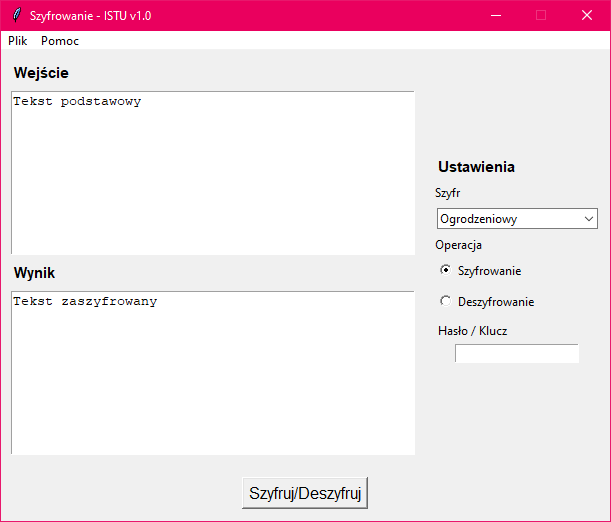

# __Aplikacja do szyfru ogrodzeniowego i transpozycji kolumnowej__

## Spis treści
- [O aplikacji](#O%20aplikacji)
- [Sposób użycia](#Sposób%20użycia)
    - [Szyfrowanie](#Szyfrowanie)
    - [Deszyfrowanie](#Deszyfrowanie)

# O aplikacji

Aplikacja pozwalająca na szyfrowanie i deszyfrowanie wybranego ciągu znaków przy pomocy szyfru ogrodzeniowego (zygzak) lub szyfru transpozycji kolumnowej.
Przygotowana została na potrzeby przedmiotu "Informatyczne Systemy Tolerujące Uszkodzenia".
  

# Sposób użycia

## __Szyfrowanie__
Aby przeprowadzić operację szyfrowania należy do pola wejścia wprowadzić żądany ciąg znaków do szyfrowania.
Następnie w sekcji ustawień należy wybrać żądany szyfr za pomocą listy rozwijanej, żądaną operację (szyfrowanie) i podać wybrany klucz.  
W przypadku szyfru ogrodzeniowego kluczem jest liczba całkowita, której wartość nie może być większa niż długość wprowadzonej wiadomości.

<b> Brak wprowadzonej wiadomości lub klucza spowoduje wyświetlenie okna błędu z informacją, które pole należy uzupełnić</b>
  
## __Deszyfrowanie__
Aby przeprowadzić deszyfrowanie postępujemy analogicznie do szyfrowania tym razem wybierając z listy operacji opcję "Deszyfrowanie".
